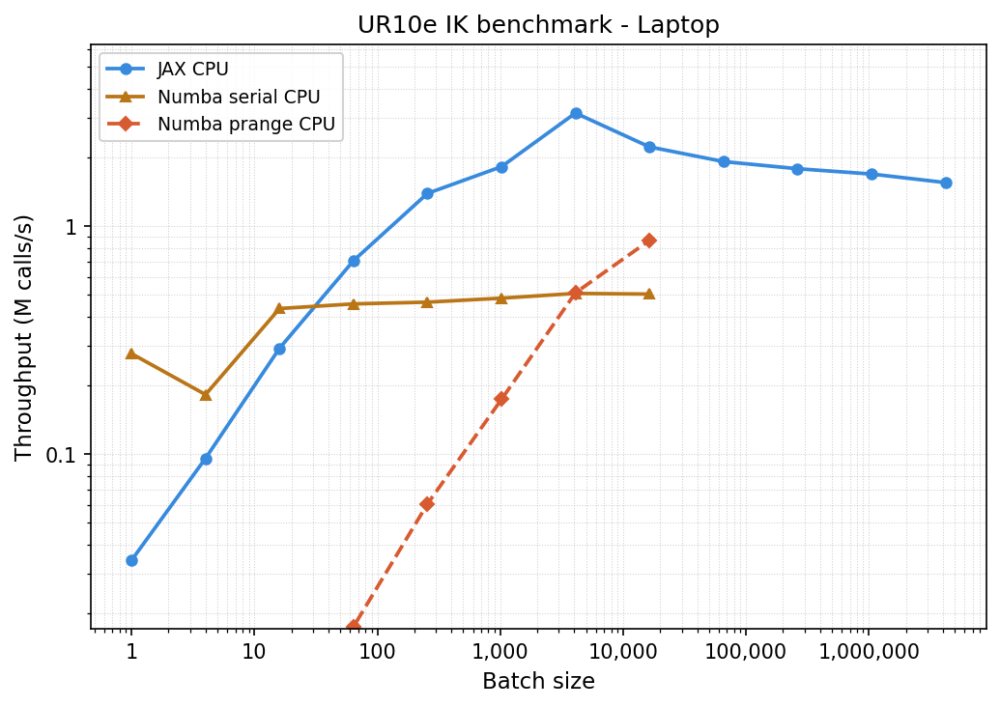
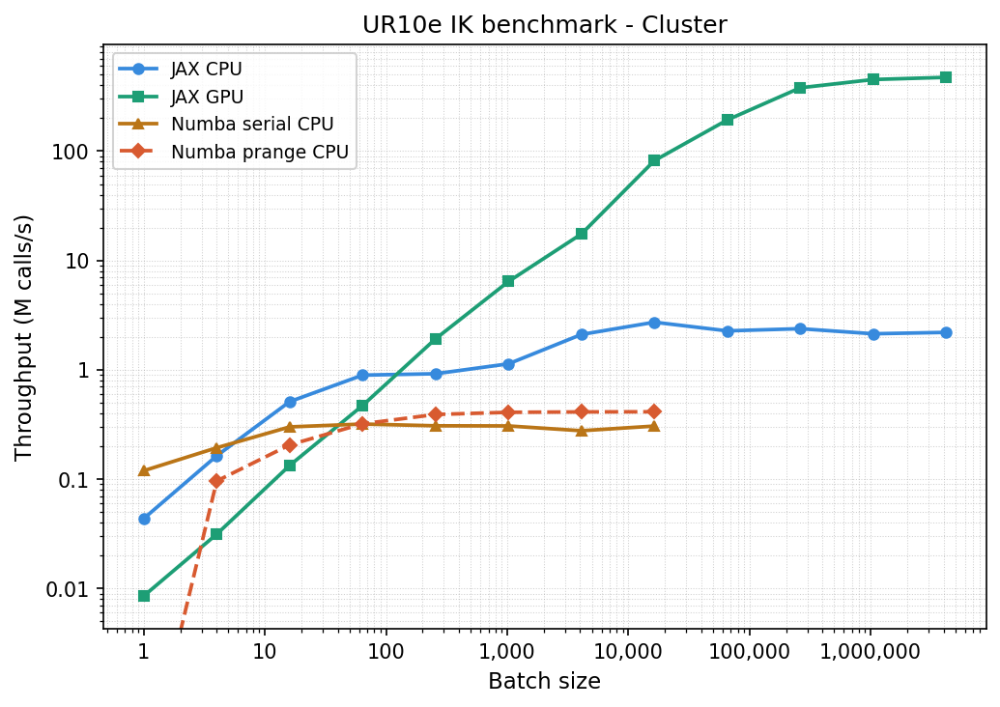
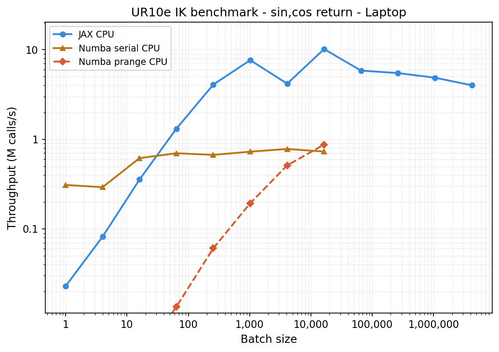
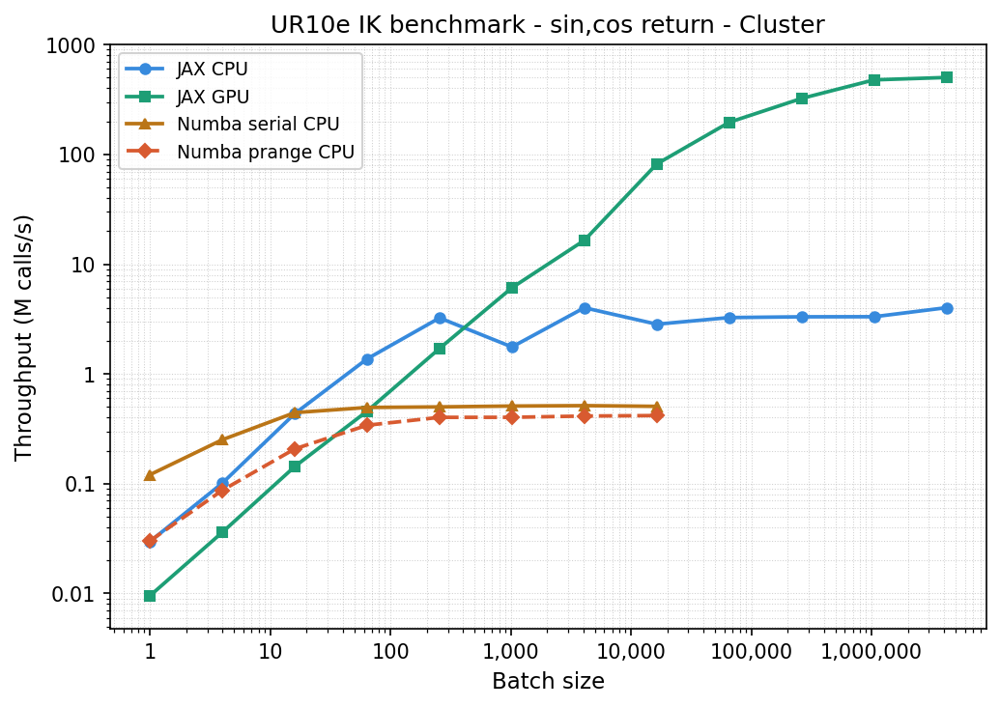

# Jaik
JAX analytic inverse kinematics: A fast solver for robots. Currently implemented are UR-robot arms, more will follow. 

With vmap batches of 4k on a A100 it reaches ~15M IK solves/s, saturating at ~500M/s at batch sizes of 4M+.

## Installation

```
pip install jaik
```

It has `jax`, `numpy`, and `sympy` as dependencies. 

## Usage

UR robots can be imported by name, which uses default DH parameters. Custom DH and PoE parameters as well as URDF as input are planned in the future. 
```
import jax
import jaik

fk, ik_full, ik_closest = jaik.make_robot("ur10e")

q = jax.random.uniform(jax.random.PRNGKey(0), (6,))
R, p = fk(q)
Qs, valid = ik_full(R,p)
q0 = q * 1.1
q, branch = ik_closest(R, p, q0)
```

There is an additional optional numba backend installable with `pip install "jaik[numba]"`. Then use it with `jaik.make_robot(name, solver="numba")`, `solver="jax"` by default. For single calls for small batches, numba is significantly faster than jax. 

The solvers avoid trigonometric functions where possible. If the first thing you do with the returned joint angles is `jnp.sin(q), jnp.cos(q)`, we can save us both some time by using the keyword `sincos=True` in `make_robot`. This returns two values per joint as `sin(q), cos(q)`. For UR robots, this avoids using trigonometric functions altogether. 

By default it expects a (3,3) rotation matrix and (3,) vector as input (`format="Rp"` in `make_robot`). It can be changed to a single (4,4) matrix with `format="T"`. 

## Planned

- Add more robots available by name
- Support for custom (calibrated) DH & PoE parameters
- Support for URDF files as input

## Benchmarks

The benchmarks were done on a Lenovo ThinkPad:
- CPU: Intel Core Ultra 7 265U, 32 GB RAM
And on a cluster:
- CPU: Intel Xeon E5-2698 v4 @ 2.20 GHz (40 cores, 32GB RAM allocated)
- GPU: NVIDIA A100-SXM4-40GB
Im unsure how much of the measured time is python-overhead or if anything got "compiled away", some guidance there would be appreciated. 

<p>
  
  
</p>

By using `sincos=True` which avoids the `atan2` calls by returning `sin(q), cos(q)` (this might not be ideal in every use-case):
<p>
  
  
</p>

## Some examples

...
